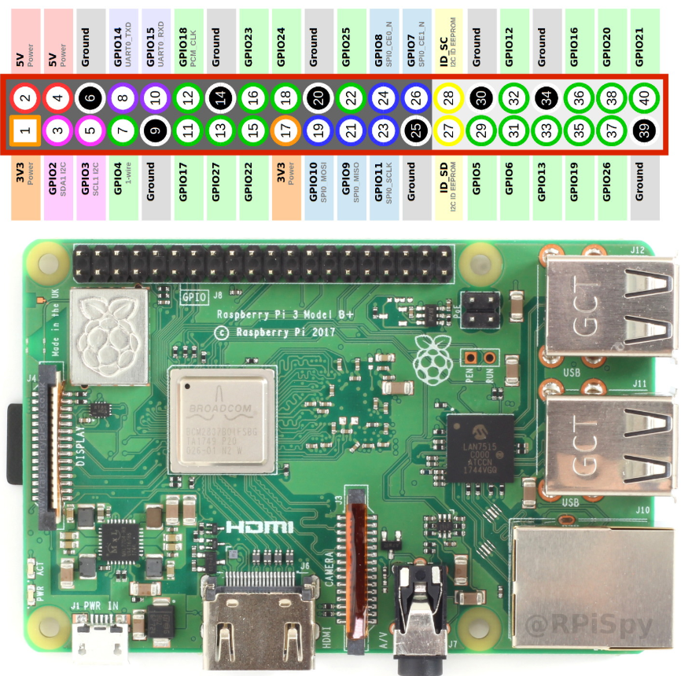

# GPS Setup — u-blox NEO-6M on a Raspberry Pi 3B+

Why the datalogger has a GPS module, how it is wired, and how to verify it.

---

## Why GPS at all

The Raspberry Pi has **no battery-backed real-time clock**. Every boot it
restores whatever `fake-hwclock` saved at the last shutdown, which is wrong by
however long it was switched off. Observed on this unit: it booted believing it
was `18:24` while the actual time was `22:58` — and logged **9,087 samples**
before a network appeared and corrected it.

For a scientific dataset that is the worst kind of failure: the timestamps look
perfectly valid and are silently wrong.

GPS fixes this without needing any network:

| | Phone hotspot / NTP | GPS |
|---|---|---|
| Works with no network | no | yes |
| Drift once offline | 1–4 s/day (Pi crystal) | none — continuously disciplined |
| After a power cut | back to the epoch | re-acquires by itself |
| Needs someone to act | yes, every deployment | no |
| Gives position | no | yes |

It also supplies **latitude, longitude and altitude**, recorded on every row.

---

## Wiring



The common **GY-NEO6MV2** breakout exposes four pins. All four land on the
**even-numbered row** — the outer row, nearest the board edge:

| Module pin | Pi physical pin | Pi function |
|---|---|---|
| **VCC** | **4** | 5V Power |
| **GND** | **6** | Ground |
| **RX** | **8** | GPIO14 / `UART0_TXD` |
| **TX** | **10** | GPIO15 / `UART0_RXD` |

```
        3.3V  ( 1) ( 2)  5V
       GPIO2  ( 3) ( 4)  5V           ←── VCC
       GPIO3  ( 5) ( 6)  GND          ←── GND
       GPIO4  ( 7) ( 8)  GPIO14 TXD   ←── GPS RX
         GND  ( 9) (10)  GPIO15 RXD   ←── GPS TX
      GPIO17  (11) (12)  GPIO18       ←── PPS (optional, see below)
```

### Two things that will bite you

**TX and RX cross.** The module's `TX` goes to the pin labelled **RXD**, and
its `RX` goes to the pin labelled **TXD**. Wiring them straight across produces
complete silence with no error message anywhere.

**Never put 5 V on pins 8, 10 or 12.** Those GPIO lines are 3.3 V and are *not*
tolerant — 5 V damages the SoC. Powering `VCC` from pin 4 is fine because the
GY-NEO6MV2 regulates on-board and its TX output is already 3.3 V logic. A bare
NEO-6M module without a regulator must be powered from **pin 1 (3.3 V)** instead.

**Power the Pi down before wiring.** Bridging adjacent pins on a live header is
the easy way to destroy the board.

### PPS (not used here)

The NEO-6M chip has a pulse-per-second output, but most 4-pin breakouts do not
bring it to the header. Without it, time comes from NMEA sentences over serial:
**~±100 ms** instead of ~1 µs.

That is fine for this application — the sample interval is 100 ms, so the
timestamp is accurate to roughly one sample. It would only matter for tight
cross-correlation against another instrument's timebase.

If you later add a PPS wire (many boards have a PPS LED pad you can tap),
connect it to **pin 12 / GPIO18**. The overlay is already configured.

---

## Pi configuration

The Pi 3B+ wires its good **PL011** UART to the Bluetooth chip by default,
leaving the GPIO pins with only the unstable mini-UART — whose baud rate drifts
with the CPU clock, which makes GPS unreliable. Before any of this, `/dev/serial0`
did not exist at all.

Added to `/boot/config.txt`:

```
enable_uart=1
dtoverlay=disable-bt              # frees PL011 for GPIO14/15
dtoverlay=pps-gpio,gpiopin=18     # inert without a PPS wire; ready if added
gpu_mem=16                        # headless unit: frees ~49 MB RAM
```

Removed from `/boot/cmdline.txt`:

```
console=serial0,115200            # or kernel boot output floods the GPS
```

And disabled the services that would otherwise hold the UART:

```bash
sudo systemctl disable --now hciuart bluetooth
```

After a reboot:

```
/dev/serial0 -> ttyAMA0    ← PL011, now on GPIO14/15
/dev/serial1 -> ttyS0      ← mini-UART, demoted
/dev/pps0                  ← present, ready for a PPS wire
```

---

## Software

```bash
sudo apt install gpsd gpsd-clients chrony pps-tools
```

> **Raspbian Buster is end-of-life.** `raspbian.raspberrypi.org` now returns
> 404. Repoint `/etc/apt/sources.list` to `legacy.raspbian.org` first, or
> nothing installs.

`/etc/default/gpsd`:

```
DEVICES="/dev/serial0"
GPSD_OPTIONS="-n"        # poll even with no client connected — needed for time
USBAUTO="false"
START_DAEMON="true"
```

Appended to `/etc/chrony/chrony.conf`:

```
refclock SHM 0 refid NMEA offset 0.100 precision 1e-1 poll 3 filter 3
makestep 1 -1
```

**`makestep 1 -1` is essential.** The stock `makestep 1 3` only allows the
clock to be stepped during the first three updates. A unit that boots at the
epoch and acquires GPS later would never be corrected, and would run with a
decades-wrong clock while reporting itself synchronised.

Enable everything at boot:

```bash
sudo systemctl enable gpsd gpsd.socket chrony
```

> `gpsd.service` ships **disabled** and socket-activated. That is fine when a
> client connects, but on this unit it was found `active` yet `disabled` — it
> would not have come back after a reboot, leaving a field deployment with no
> GPS and nothing to indicate it. Enable it explicitly.

---

## Verifying

```bash
gpspipe -w -n 10          # raw gpsd JSON
cgps                      # live status screen
chronyc sources           # GPS appears as "NMEA"
```

A working 3D fix looks like:

```json
{"class":"TPV","mode":3,"time":"2026-08-07T18:04:02.000Z",
 "lat":53.093469,"lon":8.891920,"alt":1.849}
```

`mode` values: `1` = no fix, `2` = 2D, `3` = 3D.

In chrony:

```
MS Name/IP address    Stratum Poll Reach LastRx Last sample
#* NMEA                     0    3   377      1  +490us[-295us] +/- 100ms
```

- `#` = local reference clock
- `*` = currently selected, `-` = valid candidate but not selected
- `Reach 377` (octal) = all eight recent polls succeeded

`#-` is normal and correct when a network is present: NTP at ±10 ms genuinely
beats NMEA at ±100 ms, so chrony prefers it. **Remove the network and chrony
switches to `#*` NMEA at stratum 1** — verified on this unit by commenting out
the NTP pool, after which the logger began recording `time_source=gps`.

---

## Field behaviour

The module's **blue LED blinks once per second once it has a fix.**

- **Cold start**: 30 s to 15 minutes with clear sky, since there is no stored
  almanac.
- **Indoors it usually will not fix.** Observed on this unit: 15 satellites
  visible, 0 usable — the roof attenuates a −130 dBm signal below what is
  needed to decode the navigation message. It may still report *time* from a
  single satellite while having no position.
- **The patch antenna is directional** — it must face up, toward open sky.

The logger never depends on GPS. With no fix the position columns are simply
blank and `time_source` falls back to `ntp` or `freerun`, always recorded
truthfully in the data.

---

## What the GPS actually buys you — measured

All figures below were measured on this unit on 2026-08-08, **indoors near a
window with 9–10 satellites**. Outdoors with a clear sky both time and position
improve; these are therefore a pessimistic case, not a best case.

### Time

| | Without GPS, no network | With GPS (NMEA, no PPS) |
|---|---|---|
| Absolute accuracy | **wrong by hours** — observed 4.5 h | **< 1 ms** after offset calibration |
| Jitter (std dev) | n/a | **2.0 ms** |
| Dispersion bound | n/a | ±100 ms |
| Drift when offline | 1–4 s/day | none — continuously disciplined |
| Recovery after power cut | never, without a network | automatic |

The dominant gain is not precision, it is **correctness**. A free-running Pi
does not produce slightly-wrong timestamps; it produces timestamps that are
wrong by hours and look completely plausible.

**Offset calibration matters.** NMEA sentences arrive some fixed delay after
the second they describe — serialisation at 9600 baud plus buffering. The
`offset` in `chrony.conf` compensates for it. Measured on this unit:

```
offset 0.100  ->  residual  +40 ms      (under-compensated)
offset 0.140  ->  residual  -90 us      (calibrated)
```

That is a **40-fold improvement in absolute accuracy**, and it is free. If the
module or baud rate is ever changed, re-measure with `chronyc sources` and
adjust: the residual under `Last sample` should sit near zero.

Relative timing between consecutive samples does **not** depend on GPS at all —
it comes from the instrument's own 10 Hz clock, measured here at a median
interval of 0.1002 s (p99 0.1037 s). GPS anchors that series to absolute UTC;
it does not govern the spacing within it.

### Position

| Metric | Measured (indoors, 9–10 sats) | Typical outdoors |
|---|---|---|
| Horizontal scatter | 2.2–4.5 m | ~1–2 m |
| Vertical scatter | 3.0 m | ~2–4 m |
| Reported horizontal error (`epx`/`epy`) | 8.0 / 11.0 m | 2–5 m |
| Reported vertical error (`epv`) | 30.4 m | 5–10 m |

Two properties are worth understanding before using these numbers:

**Vertical is always far worse than horizontal** — roughly 2–3× here. All
visible satellites are above the receiver, so the geometry that resolves
altitude is inherently weaker. Do not treat `alt_m` as a survey-grade height;
indoors this unit reported altitudes between −8.1 m and −5.2 m at a location
close to sea level.

**Scatter is not accuracy.** The spread of consecutive fixes measures
*repeatability*. The true position can sit systematically outside that spread,
which is what `epx`/`epy`/`epv` estimate. For a stationary instrument, averaging
many fixes reduces scatter but not systematic bias.

### What else the module provides

- **`gps_sats`** — satellites used in the fix. The single most useful quality
  indicator: below about 5, treat the position as weak.
- **`gps_mode`** — `2` = 2D (no altitude), `3` = 3D.
- **Time without position.** The receiver can decode UTC from a single
  satellite well before it has enough for a fix, so `time_source=gps` can
  appear while `lat`/`lon` are still blank. Observed here during acquisition.
- **Velocity and heading** are available from gpsd but are **not logged**, since
  the instrument is stationary. Worth adding for a moving platform.

### If you need better than ±100 ms

Wire the **PPS** output to pin 12 (GPIO18) — the overlay is already configured.
A hardware pulse-per-second edge takes time accuracy from ~±100 ms to ~1 µs,
because it removes serial transmission delay from the path entirely. Most 4-pin
breakouts do not expose PPS, but many boards have a PPS LED pad you can tap.

For this application it is unnecessary: the sample interval is 100 ms, so
sub-millisecond timing already resolves individual samples. It would only
matter for tight cross-correlation against another instrument's timebase.

---

## What ends up in the data

| Column | Meaning |
|---|---|
| `time_source` | `gps` / `ntp` / `freerun` — where the clock's authority came from |
| `time_synced` | `1` if verified, `0` if free-running |
| `lat`, `lon`, `alt_m` | position, blank when there is no fix |
| `gps_mode` | `2` = 2D, `3` = 3D |
| `gps_sats` | satellites used in the fix |

```python
trusted = df[df.time_synced == 1]        # timestamps you can defend
located  = df[df.lat.notna()]            # rows with a position
```
